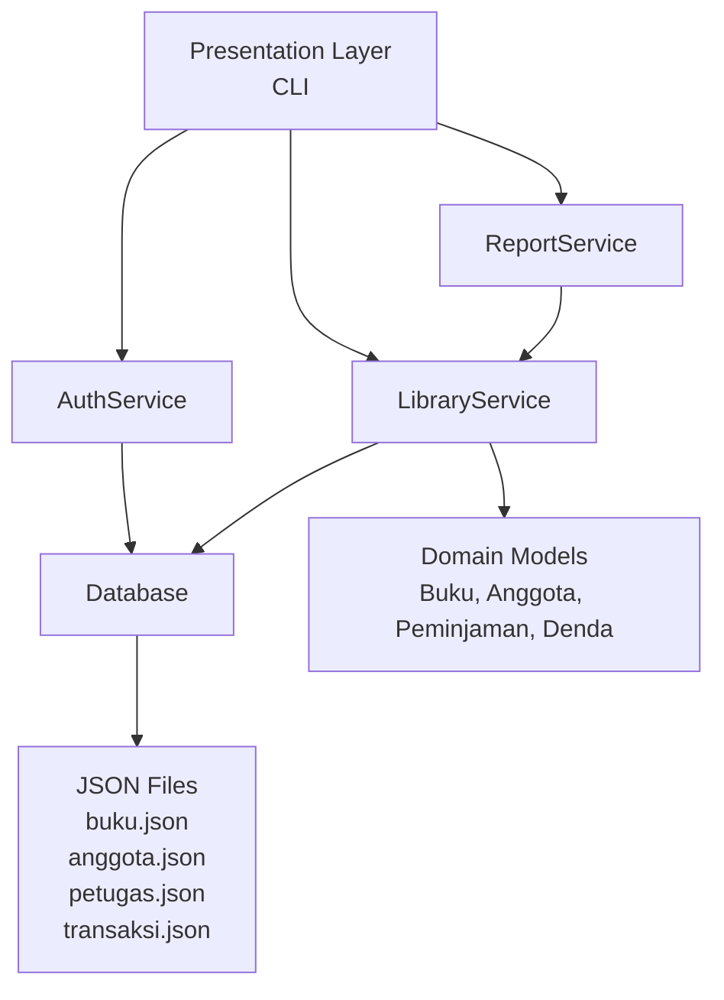
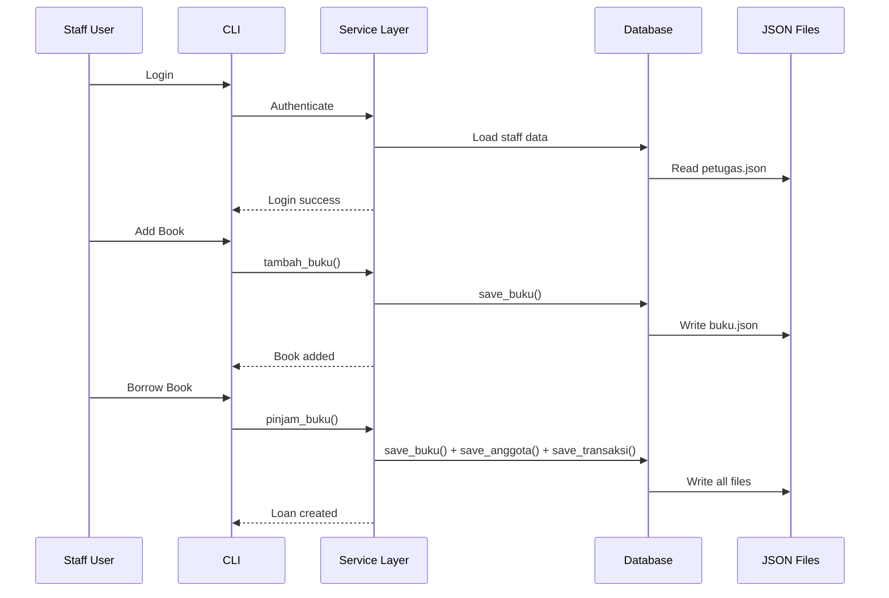

# Sistem Manajemen Perpustakaan Digital

Sistem Manajemen Perpustakaan Digital berbasis Python CLI dengan arsitektur berlapis dan prinsip Object-Oriented Programming.

## Deskripsi

Aplikasi ini dirancang untuk mengelola seluruh aktivitas perpustakaan secara digital — mulai dari manajemen koleksi buku, pendataan anggota, transaksi peminjaman, hingga pelaporan. Data disimpan secara persisten menggunakan format JSON, dan sistem dibangun dengan prinsip Clean Architecture untuk menjaga separation of concerns dan kemudahan maintenance.

## Fitur

- **Sistem Autentikasi** — Login/logout staff dengan password ter-hash (SHA256)
- **Manajemen Buku** — CRUD buku lengkap dengan tracking stok otomatis
- **Manajemen Anggota** — CRUD anggota dengan limit peminjaman
- **Transaksi Peminjaman/Pengembalian** — Peminjaman dan pengembalian dengan perhitungan denda otomatis
- **Laporan** — 7 jenis laporan (buku, anggota, transaksi, denda, statistik)
- **Penyimpanan Persisten** — Data otomatis tersimpan ke JSON dan survive restart
- **Validasi Input** — Validasi komprehensif di semua level
- **Custom Exceptions** — Exception hierarchy untuk error handling yang jelas
- **Logging** — Rotating file log dengan format terstruktur
- **Pengujian Komprehensif** — 128+ unit/integration tests dengan pytest

## Technology Stack

| Teknologi | Tujuan |
|---|---|
| Python 3.12+ | Core language |
| Standard Library | `datetime`, `json`, `pathlib`, `hashlib`, `uuid`, `abc`, `typing`, `dataclasses` |
| pytest | Testing framework |
| GitHub Actions | CI/CD pipeline |
| tabulate (opsional) | CLI table formatting |

## Gambaran Arsitektur



Aplikasi mengimplementasikan **Layered Architecture** dengan 3 layer utama:

1. **Presentation Layer** — CLI interface (main.py)
2. **Service Layer** — Business logic (services/)
3. **Data/Repository Layer** — Storage operations (storage/)

## Struktur Folder

```
.
├── .github/
│   └── workflows/
│       └── python-ci.yml          # CI/CD pipeline
├── docs/                           # Dokumentasi
│   ├── Architecture.md
│   ├── DeveloperGuide.md
│   ├── Testing.md
│   └── UserGuide.md
├── logs/                           # Log aplikasi
├── library_system/                 # Paket aplikasi utama
│   ├── main.py                    # Entry point (CLI)
│   ├── __init__.py
│   ├── models/                    # Domain models
│   │   ├── __init__.py
│   │   ├── pengguna.py            # Abstract base class
│   │   ├── anggota.py             # Member
│   │   ├── petugas.py             # Staff
│   │   ├── buku.py                # Book
│   │   ├── peminjaman.py          # Loan transaction
│   │   └── denda.py               # Fine
│   ├── services/                   # Business logic
│   │   ├── __init__.py
│   │   ├── auth_service.py        # Authentication
│   │   ├── library_service.py     # Core operations
│   │   └── report_service.py      # Reports
│   ├── storage/                    # Data persistence
│   │   ├── __init__.py
│   │   └── database.py            # JSON handler
│   ├── utils/                      # Utilities
│   │   ├── __init__.py
│   │   ├── validator.py           # Input validation
│   │   ├── helper.py              # CLI helpers
│   │   └── logger.py             # Logging config
│   ├── exceptions/                # Custom exceptions
│   │   ├── __init__.py
│   │   └── library_exceptions.py
│   └── data/                      # Penyimpanan JSON
│       ├── buku.json
│       ├── anggota.json
│       ├── transaksi.json
│       └── petugas.json
├── tests/                          # Test suite
│   ├── __init__.py
│   ├── test_auth.py
│   ├── test_books.py
│   ├── test_members.py
│   ├── test_loans.py
│   ├── test_reports.py
│   ├── test_database.py
│   └── test_cli.py
├── conftest.py                     # Pytest fixtures
├── requirements.txt                # Dependencies
└── .gitignore                      # Git ignore rules
```

## Instalasi

### Prasyarat

- Python 3.12 atau lebih baru
- pip (Python package manager)

### Setup

```bash
# Clone repositori
git clone https://github.com/fadhilyk/tugas_akhir.git
cd tugas_akhir

# Install dependencies
pip install -r requirements.txt

# Install test dependencies (opsional, untuk pengembangan)
pip install pytest pytest-cov
```

## Menjalankan Aplikasi

```bash
python library_system/main.py
```

CLI akan menampilkan menu login. Daftarkan akun staff pada saat pertama kali menjalankan, kemudian gunakan untuk login.

### Login Default

Setelah menjalankan demo, akun staff default tersedia:

| Username | Password |
|---|---|
| `admin` | `admin123` |

_Jika akun ini belum ada, Anda dapat mendaftarkan akun baru dari menu login._

## Menjalankan Tes

```bash
# Jalankan semua tes
pytest

# Jalankan dengan output verbose
pytest -v

# Jalankan dengan laporan coverage
pytest --cov=library_system

# Jalankan file tes spesifik
pytest tests/test_auth.py -v
```

## GitHub Actions

Setiap push atau pull request ke branch `main` secara otomatis menjalankan:

1. Python compilation check
2. Full test suite (128 tes)
3. Coverage report

Status badge akan muncul di repository setelah workflow pertama dijalankan.

[//]: # (![CI Status]&#40;https://github.com/fadhilyk/tugas_akhir/actions/workflows/python-ci.yml/badge.svg&#41;)

## Alur Proyek



## Placeholder Tangkapan Layar

```
[Screenshot: Login Menu]
[Screenshot: Main Menu]
[Screenshot: Book Management]
[Screenshot: Borrow Transaction]
[Screenshot: Report Example]
```

_Tangkapan layar akan ditambahkan di iterasi mendatang._

## Aturan Bisnis

- Buku dapat dipinjam jika stok > 0
- Anggota maksimal meminjam 5 buku
- Durasi peminjaman: 7 hari
- Denda keterlambatan: Rp 2.000/hari
- Buku dengan pinjaman aktif tidak dapat dipinjam lagi

## Pengembangan Mendatang

- GUI dengan Tkinter
- Database SQLite/PostgreSQL
- Ekspor laporan PDF/Excel
- Pemindai Barcode/QR Code
- REST API dengan FastAPI
- Web Dashboard
- Role-Based Access Control
- Dukungan multi-user

## Lisensi

Academic Project — Untuk Tujuan Pendidikan
