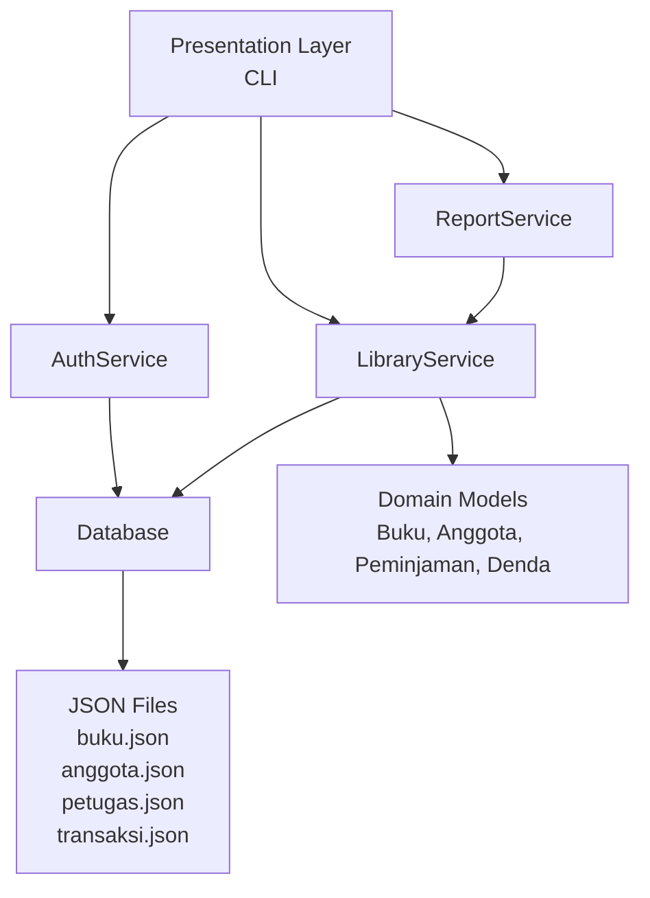
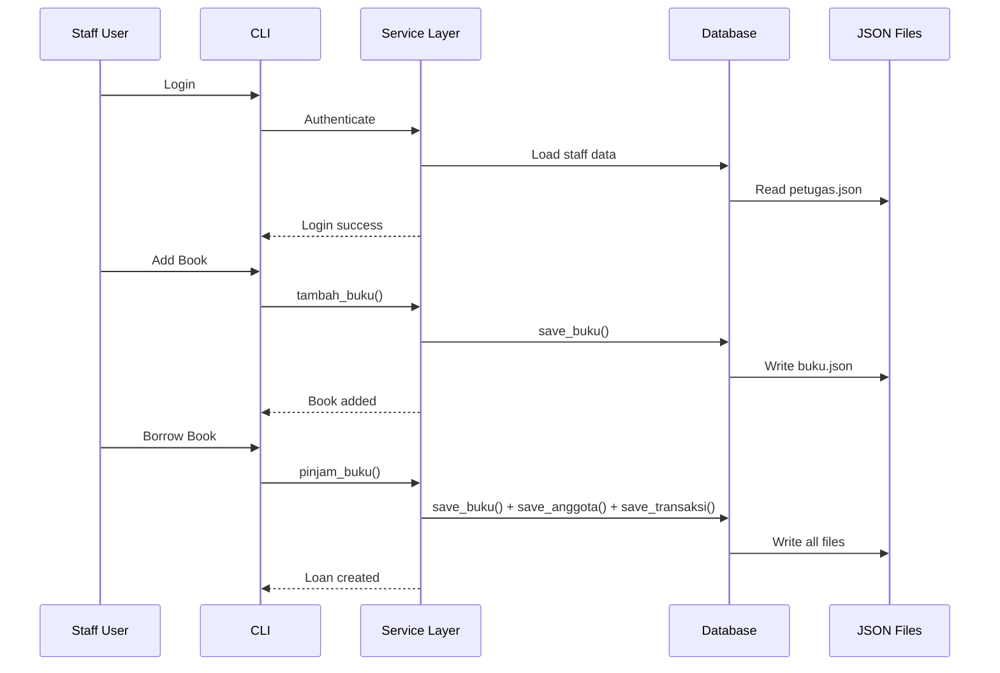

# Digital Library Management System

Sistem Manajemen Perpustakaan Digital berbasis Python CLI dengan arsitektur berlapis dan prinsip Object-Oriented Programming.

## Description

Aplikasi ini dirancang untuk mengelola seluruh aktivitas perpustakaan secara digital — mulai dari manajemen koleksi buku, pendataan anggota, transaksi peminjaman, hingga pelaporan. Data disimpan secara persisten menggunakan format JSON, dan sistem dibangun dengan prinsip Clean Architecture untuk menjaga separation of concerns dan kemudahan maintenance.

## Features

- **Authentication System** — Staff login/logout dengan password ter-hash (SHA256)
- **Book Management** — CRUD buku lengkap dengan tracking stok otomatis
- **Member Management** — CRUD anggota dengan limit peminjaman
- **Borrow/Return Transactions** — Peminjaman dan pengembalian dengan perhitungan denda otomatis
- **Reports** — 7 jenis laporan (buku, anggota, transaksi, denda, statistik)
- **Persistent Storage** — Data otomatis tersimpan ke JSON dan survive restart
- **Input Validation** — Validasi komprehensif di semua level
- **Custom Exceptions** — Exception hierarchy untuk error handling yang jelas
- **Logging** — Rotating file log dengan format terstruktur
- **Comprehensive Testing** — 128+ unit/integration tests dengan pytest

## Technology Stack

| Technology | Purpose |
|---|---|
| Python 3.12+ | Core language |
| Standard Library | `datetime`, `json`, `pathlib`, `hashlib`, `uuid`, `abc`, `typing`, `dataclasses` |
| pytest | Testing framework |
| GitHub Actions | CI/CD pipeline |
| tabulate (optional) | CLI table formatting |

## Architecture Overview



Aplikasi mengimplementasikan **Layered Architecture** dengan 3 layer utama:

1. **Presentation Layer** — CLI interface (main.py)
2. **Service Layer** — Business logic (services/)
3. **Data/Repository Layer** — Storage operations (storage/)

## Folder Structure

```
.
├── .github/
│   └── workflows/
│       └── python-ci.yml          # CI/CD pipeline
├── docs/                           # Documentation
│   ├── Architecture.md
│   ├── DeveloperGuide.md
│   ├── Testing.md
│   └── UserGuide.md
├── logs/                           # Application logs
├── library_system/                 # Main application package
│   ├── main.py                    # Entry point (CLI)
│   ├── __init__.py
│   ├── models/                    # Domain models
│   │   ├── __init__.py
│   │   ├── pengguna.py            # Abstract base class
│   │   ├── anggota.py             # Member
│   │   ├── petugas.py             # Staff
│   │   ├── buku.py                # Book
│   │   ├── peminjaman.py          # Loan transaction
│   │   └── denda.py               # Fine
│   ├── services/                   # Business logic
│   │   ├── __init__.py
│   │   ├── auth_service.py        # Authentication
│   │   ├── library_service.py     # Core operations
│   │   └── report_service.py      # Reports
│   ├── storage/                    # Data persistence
│   │   ├── __init__.py
│   │   └── database.py            # JSON handler
│   ├── utils/                      # Utilities
│   │   ├── __init__.py
│   │   ├── validator.py           # Input validation
│   │   ├── helper.py              # CLI helpers
│   │   └── logger.py             # Logging config
│   ├── exceptions/                # Custom exceptions
│   │   ├── __init__.py
│   │   └── library_exceptions.py
│   └── data/                      # JSON storage
│       ├── buku.json
│       ├── anggota.json
│       ├── transaksi.json
│       └── petugas.json
├── tests/                          # Test suite
│   ├── __init__.py
│   ├── test_auth.py
│   ├── test_books.py
│   ├── test_members.py
│   ├── test_loans.py
│   ├── test_reports.py
│   ├── test_database.py
│   └── test_cli.py
├── conftest.py                     # Pytest fixtures
├── requirements.txt                # Dependencies
└── .gitignore                      # Git ignore rules
```

## Installation

### Prerequisites

- Python 3.12 or higher
- pip (Python package manager)

### Setup

```bash
# Clone the repository
git clone https://github.com/fadhilyk/tugas_akhir.git
cd tugas_akhir

# Install dependencies
pip install -r requirements.txt

# Install test dependencies (optional, for development)
pip install pytest pytest-cov
```

## Running the Application

```bash
python library_system/main.py
```

The CLI will display a login menu. Register a staff account on first run, then use it to log in.

### Default Login

After running the demo, a default staff account is available:

| Username | Password |
|---|---|
| `admin` | `admin123` |

_If this account does not exist yet, you can register a new account from the login menu._

## Running Tests

```bash
# Run all tests
pytest

# Run with verbose output
pytest -v

# Run with coverage report
pytest --cov=library_system

# Run specific test file
pytest tests/test_auth.py -v
```

## GitHub Actions

Setiap push atau pull request ke branch `main` secara otomatis menjalankan:

1. Python compilation check
2. Full test suite (128 tests)
3. Coverage report

Status badge akan muncul di repository setelah workflow pertama dijalankan.

[//]: # (![CI Status]&#40;https://github.com/fadhilyk/tugas_akhir/actions/workflows/python-ci.yml/badge.svg&#41;)

## Project Workflow



## Screenshots Placeholder

```
[Screenshot: Login Menu]
[Screenshot: Main Menu]
[Screenshot: Book Management]
[Screenshot: Borrow Transaction]
[Screenshot: Report Example]
```

_Screenshots to be added in future iterations._

## Business Rules

- Book can be borrowed if stock > 0
- Member can borrow max 5 books
- Loan duration: 7 days
- Late fine: Rp 2,000/day
- Book with active loan cannot be borrowed again

## Future Improvements

- GUI with Tkinter
- SQLite/PostgreSQL database
- PDF/Excel report export
- Barcode/QR Code scanner
- REST API with FastAPI
- Web Dashboard
- Role-Based Access Control
- Multi-user support

## License

Academic Project — For Educational Purposes
