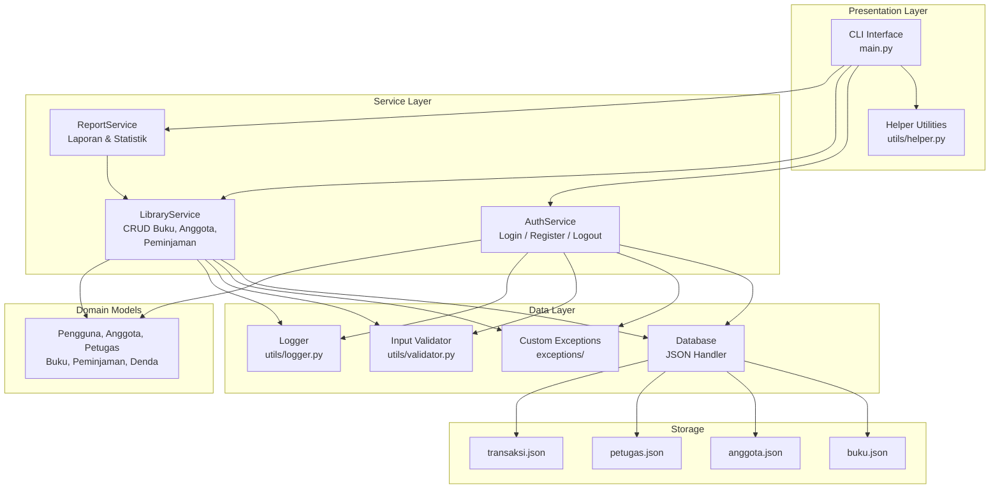
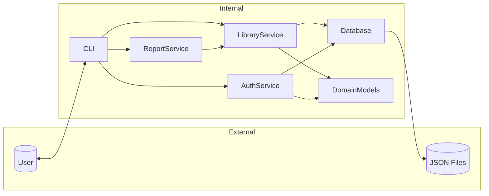
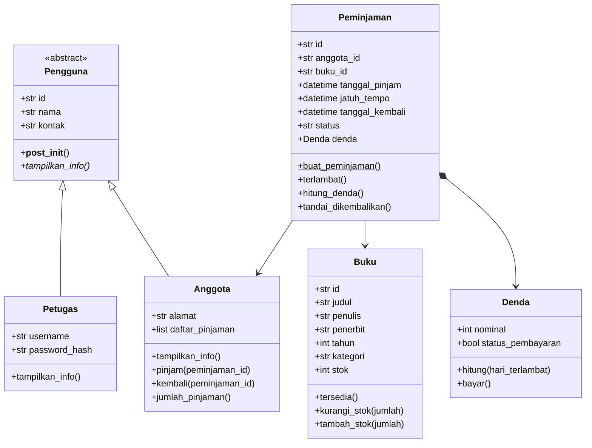
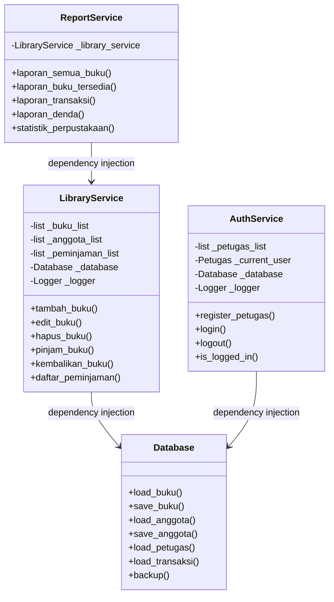
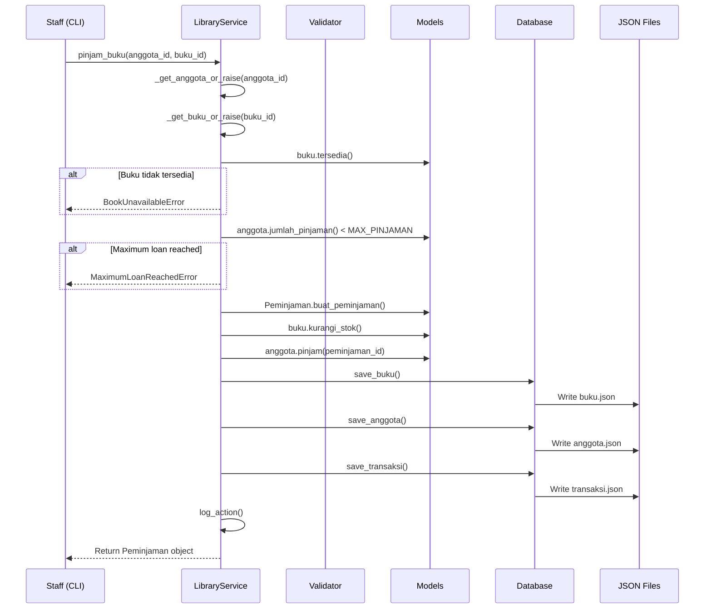
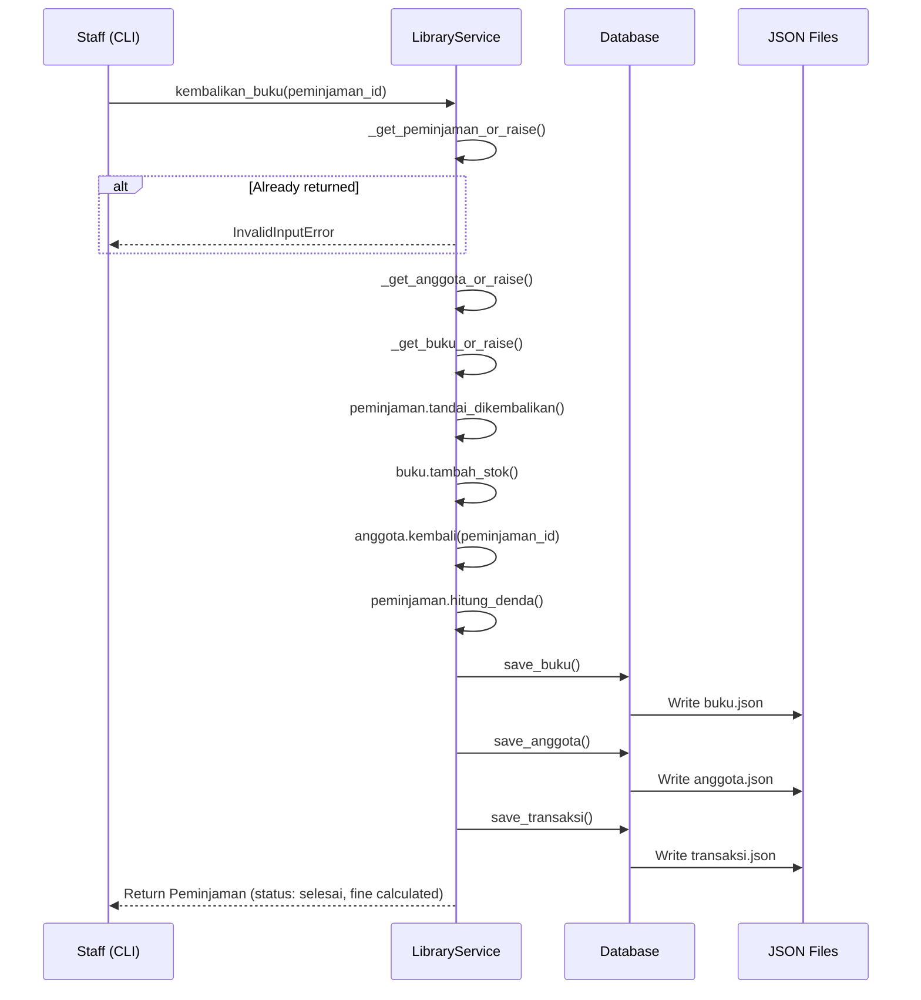

# Architecture Documentation

## Table of Contents

1. [Clean Architecture Overview](#clean-architecture-overview)
2. [System Architecture Diagram](#system-architecture-diagram)
3. [Layer Descriptions](#layer-descriptions)
4. [Dependency Flow](#dependency-flow)
5. [Class Diagram](#class-diagram)
6. [Object-Oriented Design](#object-oriented-design)

---

## Clean Architecture Overview

Aplikasi ini mengimplementasikan **Layered Architecture** yang membagi sistem menjadi tiga layer utama. Setiap layer memiliki tanggung jawab yang terpisah dan hanya berkomunikasi dengan layer di bawahnya.

```
┌─────────────────────────────────────────────────────┐
│              Presentation Layer (CLI)               │
│                   main.py / utils/                  │
│              User Interface & Menus                 │
├─────────────────────────────────────────────────────┤
│               Service Layer (Business Logic)        │
│         services/auth_service.py                    │
│         services/library_service.py                 │
│         services/report_service.py                  │
│           Transactions & Validations                │
├─────────────────────────────────────────────────────┤
│             Repository/Data Layer                   │
│              storage/database.py                    │
│               JSON File Operations                  │
├─────────────────────────────────────────────────────┤
│                 JSON Storage                        │
│             data/*.json files                        │
└─────────────────────────────────────────────────────┘
```

### Layer Rules

- **Presentation Layer** hanya boleh memanggil **Service Layer**
- **Service Layer** hanya boleh memanggil **Data Layer** dan **Models**
- **Data Layer** hanya bertanggung jawab untuk read/write file
- **Models** tidak bergantung pada layer manapun (POJO/POCO)
- Aliran data selalu **top-down**; tidak ada layer yang melewati layer di bawahnya

---

## System Architecture Diagram



---

## Layer Descriptions

### 1. Presentation Layer (CLI)

**Files:** `main.py`, `utils/helper.py`

Bertanggung jawab untuk interaksi dengan pengguna melalui command-line interface. Layer ini:

- Menampilkan menu-menu interaktif
- Menerima input dari pengguna
- Menampilkan hasil operasi dalam format tabel
- Menangani error dan menampilkan pesan yang user-friendly
- Layout dilakukan setelah operasi penting

**Key classes:** `LibraryApp`

**Design decisions:**

- Tidak mengandung business logic sama sekali
- Semua operasi didelegasikan ke Service Layer
- Helper utilities dipisahkan ke `utils/` untuk reuseability
- Table formatting menggunakan `tabulate` dengan fallback ke custom formatter

### 2. Service Layer (Business Logic)

**Files:** `services/auth_service.py`, `services/library_service.py`, `services/report_service.py`

Layer ini adalah inti dari aplikasi yang berisi semua aturan bisnis.

- **AuthService** — Manajemen autentikasi staff (register, login, logout, session)
- **LibraryService** — Semua operasi perpustakaan (CRUD buku/anggota, peminjaman)
- **ReportService** — Generate laporan dari data yang ada

**Key design principles:**

- Setiap service menerima dependency injection untuk Database
- Semua operasi CRUD otomatis menyimpan ke database
- Validasi input sebelum diproses
- Exception handling dengan custom exceptions
- Logging setiap action

### 3. Data Layer (Repository/Storage)

**Files:** `storage/database.py`

Bertanggung jawab untuk semua operasi I/O ke file JSON.

- Membuat direktori dan file secara otomatis jika belum ada
- Membaca dan menulis file JSON
- Serialisasi/deserialisasi object Python ke/dari JSON
- Backup otomatis

**Error handling:**

- Corrupted JSON → return empty list + log warning
- Missing file → create new empty file
- Invalid data → raise DatabaseError

### 4. Domain Models

**Files:** `models/*.py`

Model-model domain yang merepresentasikan entitas bisnis.

- **Pengguna** (ABC) → **Anggota**, **Petugas**
- **Buku**
- **Peminjaman** → **Denda**

Models menggunakan `@dataclass` untuk boilerplate-free code dan memiliki validasi di `__post_init__`.

---

## Dependency Flow



### Dependency Injection

Services menerima instance `Database` melalui constructor injection:

```python
class LibraryService:
    def __init__(self, database: Database = None):
        self._database = database if database else Database()
```

Ini memungkinkan:
- Testing dengan temporary database
- Mudah diganti ke storage lain (SQLite, PostgreSQL)
- Isolation antar komponen

---

## Class Diagram



### Inheritance

- **Pengguna** → Abstract base class dengan method abstract `tampilkan_info()`
- **Anggota** → extends Pengguna, menambahkan loan tracking
- **Petugas** → extends Pengguna, menambahkan authentication

### Composition

- **Peminjaman** memiliki **Denda** (composition relationship)
- Denda dibuat otomatis saat peminjaman selesai jika terlambat

### Relationships in Service Layer



---

## Object-Oriented Design

### Abstraction

`Pengguna` adalah abstract class yang mendefinisikan kontrak untuk semua tipe pengguna. Method abstract `tampilkan_info()` dipaksa untuk diimplementasikan oleh subclass.

### Inheritance

```python
class Anggota(Pengguna):   # IS-A relationship
class Petugas(Pengguna):   # IS-A relationship
```

### Encapsulation

- Semua atribut di models menggunakan public access (dataclass style)
- Service layer menggunakan `_` prefix untuk private attributes
- Validasi di `__post_init__` melindungi invariants

### Polymorphism

Method `tampilkan_info()` diimplementasikan berbeda di Anggota dan Petugas, namun dapat dipanggil melalui referensi Pengguna.

### SOLID Principles

| Principle | Implementation |
|---|---|
| **S**ingle Responsibility | Setiap class memiliki satu tanggung jawab (Buku → data buku, Peminjaman → transaksi) |
| **O**pen/Closed | Class terbuka untuk extension (tambah subclass Petugas) tapi tertutup untuk modifikasi |
| **L**iskov Substitution | Anggota dan Petugas dapat menggantikan Pengguna tanpa mengubah behavior |
| **I**nterface Segregation | Abstract class Pengguna hanya memiliki method yang relevan |
| **D**ependency Inversion | Services bergantung pada abstraksi Database, bukan implementasi konkrit |

---

## Use Case Diagram

```mermaid
graph TB
    subgraph Actors
        Staff["Staff/Petugas"]
    end

    subgraph "Library Management System"
        Login["Login"]
        Logout["Logout"]
        CRUD_Book["CRUD Buku"]
        CRUD_Member["CRUD Anggota"]
        Borrow["Pinjam Buku"]
        Return["Kembalikan Buku"]
        Reports["Lihat Laporan"]
    end

    Staff --> Login
    Staff --> Logout
    Staff --> CRUD_Book
    Staff --> CRUD_Member
    Staff --> Borrow
    Staff --> Return
    Staff --> Reports

    Borrow ..> CRUD_Member : <<includes>>
    Borrow ..> CRUD_Book : <<includes>>
    Return ..> CRUD_Book : <<includes>>
```

---

## Sequence Diagrams

### Borrow Book Sequence



### Return Book Sequence


